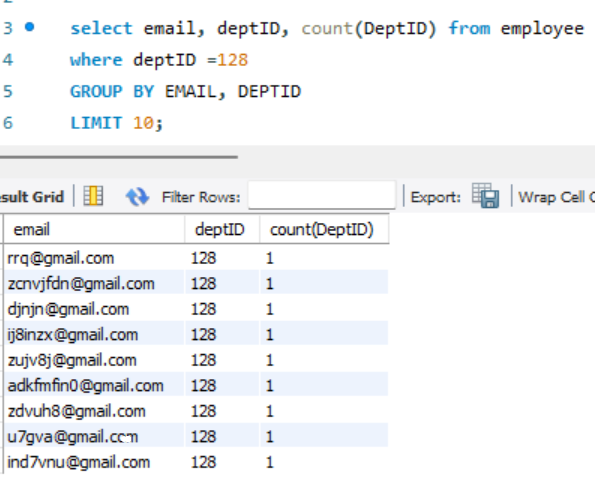

### SQL-Project

#### Introduction:
Data holds the key to informed decision-making, strategy development, and performance evaluation.

Within SQL, there are several critical commands that aid valuable insights. In this project, ten essential business questions were generated and they rely on SQL's aggregate functions, GROUP BY, HAVING, ROW_NUMBER(), JOIN, and subquery.

These questions not only demonstrate the versatility of SQL but also illustrate how it plays a vital role in helping businesses make data-driven decisions and optimize operations.

#### Problem Statement:
You are to come up with 10 critical business questions and provide answers to them. Use the dataset provided to ensure solutions have needs for the following command:

- Aggregate functions
- Group by
- Having
- Row_Number()
- Join
- Subquery

#### Generated Questions:

1. Calculate the number of employee names who live in Mumbai city
2. Using the salary table, Calculate the sum of the yearly increments of employees
3. Run a query showing the names and cities of employees, and indicate the number of unique pincode associated with each name and city
4. Run a subquery showing the ID of employees whose yearly salary increment is less than the average yearly increment
5. alculate the number of pin codes in Pune city and show the employee's name and email for those pin codes that appear only once
6. Run a query that returns the name, Fname, date of birth, and pin code for individuals in Delhi as "Employee_Info." and filter the results to include only pin codes less than 410210
7. Run a query to determine the count of deptIDs, retrieve email addresses, and deptIDs that are equal to 128, and limit the results to 10
8. Run a query returning the highest base salary recorded in the Salary table
9. Run a query that joins name, phone, and base from Employee and salary table
10. Run a query that joins name, city, education from employee and department table

#### Results/Discussion:

The screenshot above shows the calculated number of employee names who live in Mumbai city and the syntax used is as follows;

_SELECT COUNT(EmployeeName)
FROM YourTable
WHERE City = “Mumbai”;_

The snapshot above shows the total salary of yearly increments of employees and the syntax used is as follows;

_SELECT SUM(YearlyIncrement) AS TotalYearlyIncrement
FROM Salary;_

The screenshot above indicates the names and cities along with the number of unique pin codes associated with each name and city. 
The syntax used is as follows;

_SELECT Name, City, COUNT(DISTINCT PinCode) AS NumberOfPinCodes
FROM Employee
GROUP BY Name, City;_

The screenshot above illustrates the IDs of employees whose yearly salary increment is less than the average in the salary table and the command used is as follows;

_SELECT EmpID
FROM Employee
WHERE YearlyIncrement < (SELECT AVG(YearlyIncrement) FROM salary)_

The screenshot above shows the employee's name and email for pin codes that appear only once in Pune city within the employee table and the syntax used is as follows;

_SELECT Name, Email
FROM Employee
WHERE City = 'Pune'
GROUP BY Name, Email 
HAVING no_of_pincode= 1);_

The screenshot above shows the name, fname, date of birth, and pin code for individuals in Delhi as "Employee_Info," and filters the result to include pin codes that are less than 410210. The syntax used is as follows;

_With employee_info as (SELECT Name, Fname, Dob, PinCode from employee
WHERE City = 'Delhi')
Select * from employee_info where pin code < 410210;_

The screenshot above displays the number of deptIDs, retrieve email addresses, and deptIDs where deptID is 128, and limit the results to the first 10 records within the table and the syntax used is as follows;

_SELECT email, deptID, COUNT(deptID)
FROM Employee
WHERE deptID = 128
LIMIT 10;_

The snapshot above returns the highest base recorded in the Salary table and the syntax used is as follows; 

_SELECT MAX(Base)
FROM Salary;_

The screenshot above displays name, phone, and base information from the "Employee" and "Salary" tables, joined based on the "EmpID" column.
The syntax used is as follows;

_SELECT name, phone, sbase
FROM Employee 
JOIN Salary ON employee. empID = salary. EmpID;_

The screenshot above returns the name, city, education, and department information from the "Employee" and "Department" tables, joined based on the "DeptID" column.

_SELECT name, city, education 
FROM Employee 
JOIN department ON employee. DeptID = Department. DeptID;_

#### Conclusion:

The queries above encompass a range of data analysis tasks achievable through SQL. A variety of commands such as Aggregate functions, Group by, Having, Join, subquery, and Row_Number() were employed to extract valuable insights from the database. These queries are essential tools for extracting, filtering, and analyzing data for meaningful insights. Additionally, They exemplify how SQL empowers data professionals to perform sophisticated analysis and retrieve significant information from their datasets.

